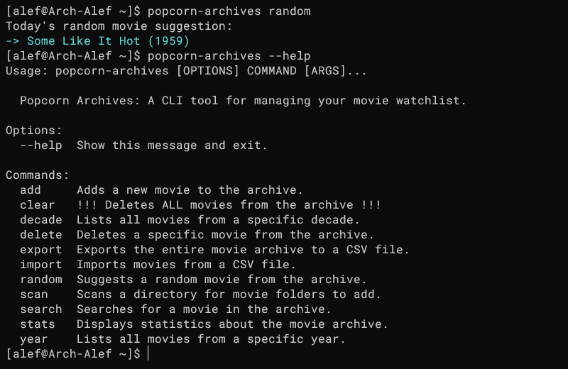
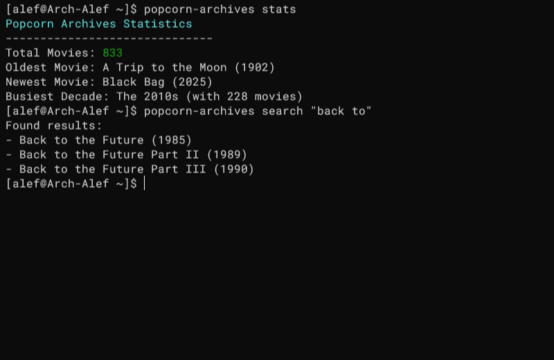

# Popcorn Archives 🍿

A simple and powerful command-line tool to manage your personal movie watchlist, built with Python and Click.

## In Action

A quick look at the `random` and `stats & search` commands:

| Scanning a Directory | Viewing Archive Statistics |
| :------------------: | :------------------------: |
|  |  |

## Features

-   ✅ **Flexible Movie Detection**: Intelligently scans your movie directories using two common naming formats: `Movie Title YYYY` and `Movie Title (YYYY)`.
-   ✨ **Robust Error Handling**: Gracefully skips folders it cannot parse and provides a clear warning list, instead of crashing.
-   📥 **Bulk Import & Export**: Easily import your existing collection from a CSV file, or export your entire archive for backup and sharing.
-   📊 **Archive Statistics**: Use the `stats` command for a quick overview, including total movie count, oldest/newest movies, and the most populated decade.
-   🔎 **Powerful Search & Filtering**: Instantly search for any movie in your archive, or filter your collection by a specific year or decade.
-   🗑️ **Full Data Management**: Add, delete individual movies, or clear the entire archive with interactive, safety-first confirmation prompts.
-   ⚙️ **Persistent & Safe Storage**: Uses a local SQLite database stored in a standard user data directory, ensuring your archive is safe even if you move or delete the project folder.

## Installation

There are two ways to install Popcorn Archives, depending on your goal.

### Option 1: As a System-Wide Command (Recommended for Users)

If you just want to use the application, the best way is to install it with `pipx`. This installs the tool in an isolated environment but makes the command available everywhere in your system.

**1. Install pipx**
If you don't have `pipx`, install it using your system's package manager (e.g., `sudo apt install pipx`, `brew install pipx`). Then, ensure its path is configured:
```bash
pipx ensurepath
```

**2. Install Popcorn Archives**
Clone the repository and install directly from the local path using `pipx`:
```bash
git clone https://github.com/alefbee/popcorn-archives.git
cd popcorn-archives
pipx install .```
The `popcorn-archives` command is now ready to use from any terminal!

### Option 2: For Development

If you want to modify or contribute to the code, set it up in a local virtual environment.

**1. Clone the Repository**
```bash
git clone https://github.com/alefbee/popcorn-archives.git
cd popcorn-archives
```

**2. Create and Activate a Virtual Environment**
```bash
python3 -m venv .venv
source .venv/bin/activate
```

**3. Install in Editable Mode**
This installs the project and its dependencies, allowing your code changes to be reflected immediately.
```bash
pip install -e .
```

## Updating

To update Popcorn Archives to the latest version, navigate to the project directory and run:

```bash
# Get the latest changes from GitHub
git pull origin main

# Re-install to apply updates
# If using pipx:
pipx install --force .

# If using a virtual environment:
pip install -e .
```

## Usage

Here are the available commands:

| Command | Description | Example |
| :--- | :--- | :--- |
| `add` | Adds a new movie to the archive. | `popcorn-archives add "The Kid 1921"` |
| `scan` | Scans a directory for movie folders. | `popcorn-archives scan /path/to/movies` |
| `import` | Imports movies from a CSV file. | `popcorn-archives import movies.csv` |
| `export` | Exports the entire archive to a CSV. | `popcorn-archives export backup.csv` |
| `search` | Searches for a movie by title. | `popcorn-archives search "Casablanca"` |
| `random` | Suggests a random movie. | `popcorn-archives random` |
| `year` | Lists movies from a specific year. | `popcorn-archives year 1942` |
| `decade` | Lists movies from a specific decade. | `popcorn-archives decade 1940` |
| `stats` | Displays archive statistics. | `popcorn-archives stats` |
| `delete` | Deletes a specific movie. | `popcorn-archives delete "The Matrix 1999"` |
| `clear` | Clears the entire movie archive. | `popcorn-archives clear` |

## Uninstalling

If you wish to completely remove Popcorn Archives and all its data from your system, follow these two steps.

**Step 1: Uninstall the Application**

This removes the command-line tool itself.

-   **If you installed with `pipx`:**
    ```bash
    pipx uninstall popcorn-archives
    ```
-   **If you installed for development (with `pip`):**
    Simply delete the project folder. If you created a virtual environment inside it, that will be removed as well.

**Step 2: Remove the User Data and Database**

This step deletes your movie database (`movies.db`). **This action is irreversible.**

The application stores its data in a standard user data directory, which varies by operating system. You need to manually delete this folder.

-   **On Linux:** The data is usually stored in the `~/.config` directory. Note that the application name might be converted to lowercase.
    ```bash
    # The application name is "PopcornArchives", so the folder is likely "popcornarchives"
    rm -rf ~/.config/popcornarchives
    ```

-   **On macOS:** The data is stored in the `Application Support` folder.
    ```bash
    rm -rf ~/Library/Application\ Support/PopcornArchives
    ```

-   **On Windows:** The data is stored in the `AppData\Roaming` folder. You can paste this path directly into the File Explorer address bar.
    ```
    %APPDATA%\PopcornArchives
    ```

> **Tip:** You can use the `popcorn-archives where` command to see the exact path of the database file before you uninstall the application.

## About This Project

This project was developed as a personal learning journey to create a useful, real-world command-line application in Python. It was an opportunity to practice key software development concepts, including:

-   Building a robust CLI with `Click`.
-   Database management with `SQLite`.
-   Creating an installable package with `setuptools`.
-   Following best practices for project structure and documentation.
-   Implementing version control with Git and GitHub.

This project was built with significant assistance from AI tools like Google's Gemini.